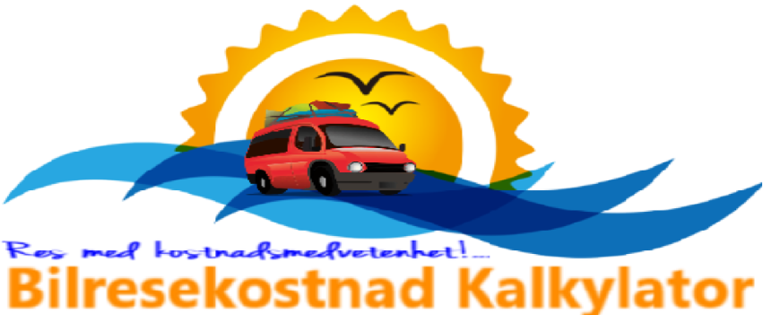
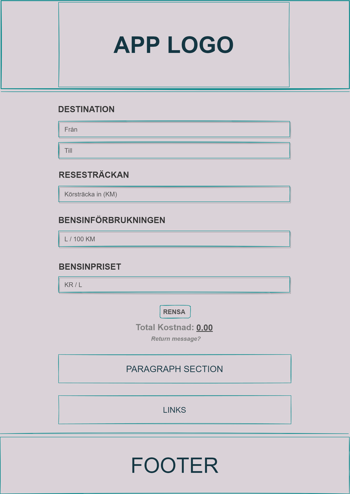
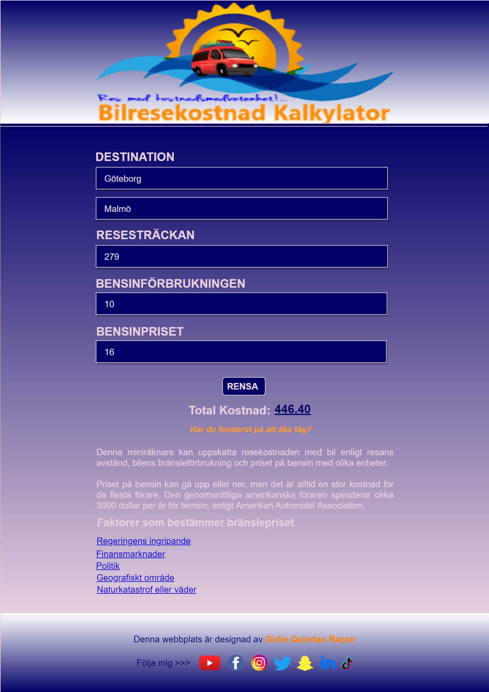
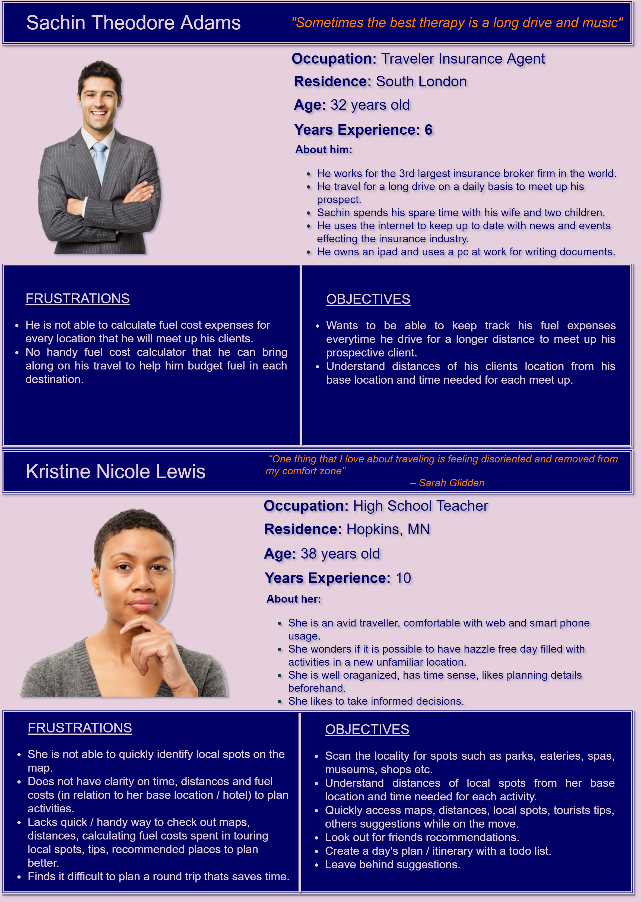

# Inlämnings Uppgift 2021-06-27: Bilresekostnad Kalkylator

## Steg:

1. Skapa en app logo

2. Skapa wireframe och prototype för projektet

3. Skapa react projekt med `webb2-uppgift-2021-06-27` som namn
4. `cd webb2-uppgift-2021-06-27`
5. `npm start`
6. `npm install react-router-dom`
7. `npm install tachyons@4.12.0`
8. Rensa bort onödigt
9. Skapa projektstruktur
10. Skaffa fonterna:
    - Oleo Script - Regular
    - Oxygen - Regular
11. Skaffa färgschema som:
    - `primary-color: #000066`
    - `secondary-color: #E6D0DE`
    - `thirdly-color: #FF8000`
12. Skapa en navbar komponent i foldern `components`
13. Skapa en global.css i foldern `utils/global/css`
14. Skapa en footer mapp i foldern component
15. Skapa footer samt social media komponenter i foldern `components/footer`
16. Installera: 
    - `@fortawesome/fontawesome-svg-core`
    - `@fortawesome/free-brands-svg-icons`
    - `@fortawesome/free-solid-svg-icons`
    - `@fortawesome/react-fontawesome`
17. Skapa en main komponent i foldern `components`
18. Skapa en fuel cost calculator komponent i foldern `components`
19. Kalkylator lösningar är:
    1. Importera React och useState from react  `import React, { useState } from 'react';`
    2. Importera global css `import '../utils/global/css/global.css'`
    3. Skapa arrow funktion med ett namn fuel cost calculator `export const FuelCostCalculator = () =>{}` och returnera med label och input för variabler sträckan, förbrukningen och priset
    4. Skapa useState och onChange variabler för (sträckan, förbrukningen och bensinpriset) som:
        - `const [distance, setDistance] = useState('');`
            - `const handleDistanceChange = (event) => {setDistance(event.target.value);};`

        - `const [fuelConsumption, setFuelConsumption] = useState('');`
            - `const handleFuelConsumptionChange = (event) => {setFuelConsumption(event.target.value);};`

        - `const [fuelPrice, setFuelPrice] = useState('');`
            - `const handleFuelPriceChange = (event) => {setFuelPrice(event.target.value);};`
    5. Lägga till onChange variabler i input respektive:
        - `<input className='input__item__one' placeholder='Körsträcka (KM)' type='number'onChange={ handleDistanceChange }/>`
        - `<input className='input__item__two' placeholder='L / 100 KM' type='number' onChange={ handleFuelConsumptionChange }/>`
        - `<input className='input__item__three' placeholder='KR / L' type='number' onChange={ handleFuelPriceChange }/>`
    6. Skapa en variabel för att kalkylera bilresekostnad som:
        - `let FuelCost = (distance / 100 * fuelConsumption * fuelPrice).toFixed(2);`
    7. Lägga till FuelCost variabel i elementet som jag vill att resultatet ska synas. Som t.ex:
        - `<h3 className='total__cost__label'>Total Kostnad:  <u>{ FuelCost }</u></h3>`
    8. Skapa en funktion med ett namn DisplayMessage() med if - else if - else statements som t.ex. 
        - `function DisplayMessage() {
            if  (FuelCost >= 1001) {
            return 'Har du funderat på flyg?'
            } else if (FuelCost >= 400) {
            return 'Har du funderat på att åka tåg?'
            } else if (FuelCost >= 1) {
            return 'Resonabel resa'
            } else {
            return ''
            }
        };` 
    9. Lägga till funktionen var resulatet ska synas. Som t.ex.
        - `{ DisplayMessage() }`
    10. Skapa useState och varibel handleResetInput för att rensa inputs samtidigt. Som t.ex.
        - `const [resetInput, setResetInput] = useState(0);`
        - `const handleResetInput = (event) => {setDistance(0); setFuelConsumption(0); setFuelPrice(0);
        Array.from(document.querySelectorAll('input')).forEach(input => (input.value='')
             );
             setResetInput({
            itemvalues: [{}]
            }); }`
    11. Lägga till {handleResetInput} i rensa button, som t.ex.
        - `<button onClick={ handleResetInput } className='btn__clear'>rensa</button>`
20. Skapa en paragraph section komponent i foldern `components`
21. Skapa en Link komponent i foldern `components`
22. Skapa Bilresekostnad Kalkylator app personas som:
